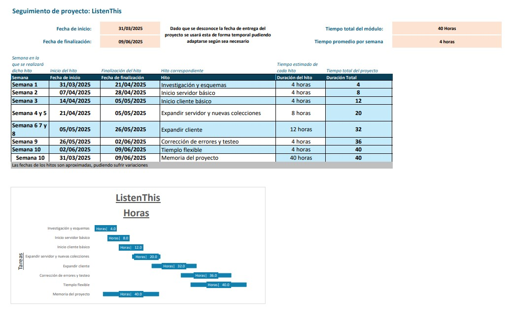

# ListenThis - Proyecto de Fin de Grado

## Introdución

En esta repositorio se encontrará toda la información relacionada con el proyecto, dividiendose este de la siguiente forma:

- Servidor de ListenThis, donde encontraremos lo siguiente:
    - API escrita con KTOR
    - Fichero para configurar la base de datos
    - Breve explicación de como se almacenarán los ficheros de los usuarios
- Cliente de ListenThis, este contendrá lo siguiente:
    - Lógica común para todas las plataformas. Esto incluirá:
        - Vistas
        - Modelos de los objectos (usuarios, publicaciones...)
    - Implementaciones especificas para cada plataforma, encontrando las siguientes:
        - Implementación del sistema de crear publicaciones
        - Implementación de la carga de vídeos para cada sistema

Para la organización del proyecto, se seguirá el siguiente calendario:

    
## Servidor:

El servidor de ListenThis se ha realizado con Ktor y se cuenta con un Readme.md con más información [aquí.](./Server/README.md)

## Cliente:

El cliente de ListenThis se ha realizado con Kotlin MultiPlatform (KMP) y se encuentra disponible en las siguientes plataformas:

- Android
- Escritorio

Se cuenta con más información detallada aquí

> [!IMPORTANT]
> Agregar enlace al Readme interno.
